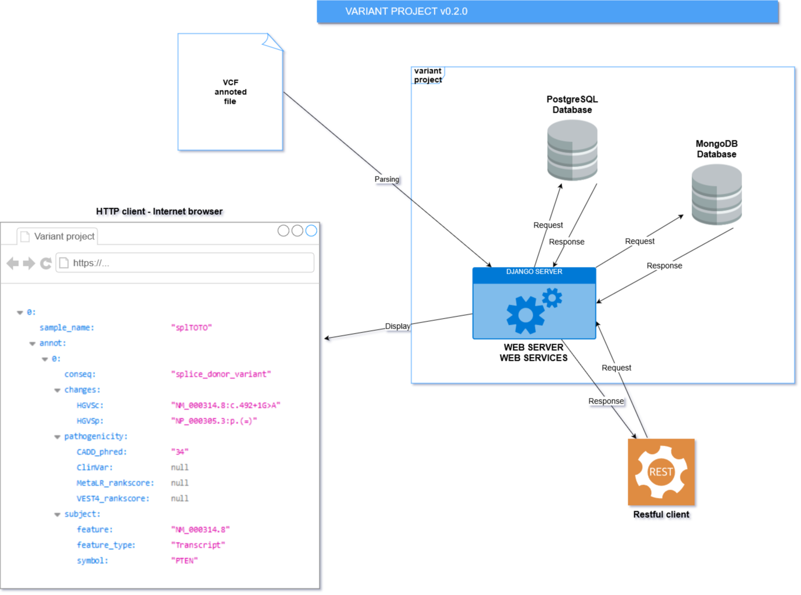

# Variant project

> Parse annotated VCF files and extract variant information.
>
> Manage variant with database and requests.
>
> Provide web services for doing request about variants (create variant, find variant samples, and so on)

### Operating diagram for variant_project v0.2.0

### Warning

There is two versions of the python library pysam : on a windows system install **pysam-win**, and install **pysam** for
other systems.

## Run the Django project server

> python manage.py runserver

## Launch the tests of the project

> python manage.py test

## Main web service uvicorn script file

> mainScriptWS.py
