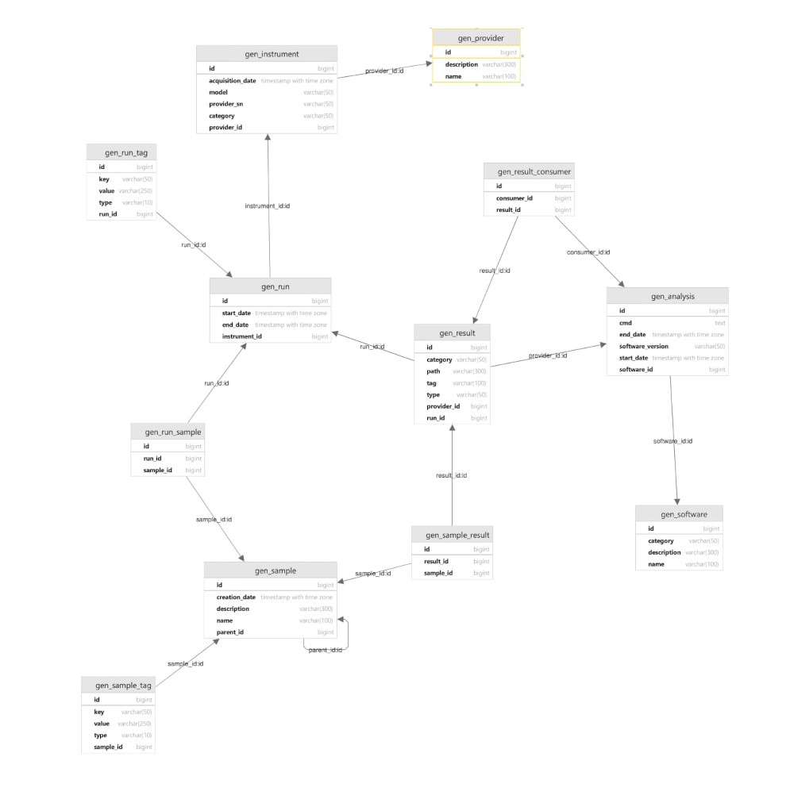
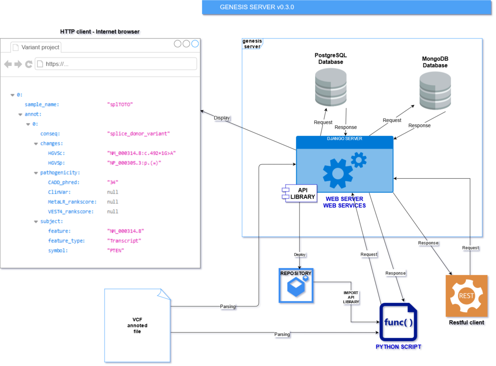

# Release 0.4.0 [2021-07-20]

### Changes

> The analyse data are managed.
> The main web services are implemented.

### Improvements

- The analyse data are now managed, the data relational model is available below :



- The sample demo data are deleted.
- Main web services are now available, the following list presents them :

```py
    # get
    path('sample/<int:pk>/', views_ws.SampleDetail.as_view(), name='get_run'),

    # get all
    path('sample/', views_ws.SampleList.as_view(), name='get_all_sample'),

    # post
    path('sample/', views_ws.SampleDetail.as_view(), name='post_sample'),

    # put : the parent of the sample is modified
    path('sample/<int:pk>/parent/', views_ws.SampleDetail.as_view(), name='put_sample_parent'),

    # post
    path('sample_tag/', views_ws.SampleTagDetail.as_view(), name='post_sample_tag'),

    # post
    path('provider/', views_ws.ProviderDetail.as_view(), name='post_provider'),

    # post
    path('instrument/', views_ws.InstrumentDetail.as_view(), name='post_instrument'),

    # get
    path('run/<int:pk>/', views_ws.RunDetail.as_view(), name='get_run'),

    # get all
    path('run/', views_ws.RunList.as_view(), name='get_all_run'),

    # post
    path('run/', views_ws.RunDetail.as_view(), name='post_run'),

    #post
    path('run_tag/', views_ws.RunTagDetail.as_view(), name='post_run_tag'),

    # get
    path('result/<int:pk>/', views_ws.ResultDetail.as_view(), name='get_result'),

    # get all
    path('result/', views_ws.ResultList.as_view(), name='get_all_result'),

    # post
    path('result/', views_ws.ResultDetail.as_view(), name='post_result'),

    # put
    path('result/<int:pk>/', views_ws.ResultDetail.as_view(), name='put_result'),

    # post
    path('software/', views_ws.SoftwareDetail.as_view(), name='post_software'),

    # get
    path('analysis/<int:pk>/', views_ws.AnalysisDetail.as_view(), name='get_analysis'),

    # get all
    path('analysis/', views_ws.AnalysisList.as_view(), name='get_all_analysis'),

    # post
    path('analysis/', views_ws.AnalysisDetail.as_view(), name='post_analysis'),

    # post
    path('result_consumer/', views_ws.ResultConsumerDetail.as_view(), name='post_result_consumer'),

    # post
    path('sample_result/', views_ws.SampleResultDetail.as_view(), name='post_sample_result'),

    # post
    path('run_sample/', views_ws.RunSampleDetail.as_view(), name='post_run_sample'),
```

- The API library is updated.

- The server documentation is updated.
- The API document is updated.
- The code is refactored.

### Bug fixes

> Not applicable

# Release 0.3.0 [2021-07-20]

### Operating diagram for genesis server v0.3.0



### Changes

> A server API allows to do requests to the genesis server server thanks a simple python script and without know the server structure.

### Improvements

- The project name is renamed: **genesis server**.
- The API library is implemented.

- The documentation is updated.
- The code is refactored.

**CAUTION :** In this version, the sample object are not final.

### Bug fixes

> Not applicable.

# Release 0.2.0 [2021-06-25]

### Operating diagram for variant_project v0.2.0


### Changes

> The Django server manage both web application and web services :
>
> So, the FastAPI for web services is not used anymore.
> The Pydantic objects in accordance with the FastAPI documentation are not used anymore.

> Therefore, now only one server is used for managing two different applications :
>
>- Web application
>- Web services
>
> See the **Operating diagram part** above.

### Improvements

- The VCF variant files are parsed and recorded into mongoDB database.
- The variants can be displayed on internet client.
- Requests on variants are availables thanks web services.


- Samples are managed by the postgreSQL database.
- The sample management, and its components, are possible thanks the site admin interface.
- Requests on samples are availables thanks web services.


- The documentation is updated.
- The code is refactored.

**CAUTION :** In this version, the sample object are not final.

### Bug fixes

> Not applicable.

# Release 0.1.0 [2021-06-15]

> First release.

### Operating diagram for variant_project v0.1.0


### Changes

> Not applicable.

### Improvements

The first version allows parsing and management of variants, requests on them and displaying.

It is a version for some tests and technical checks.

### Bug fixes

> Not applicable.
