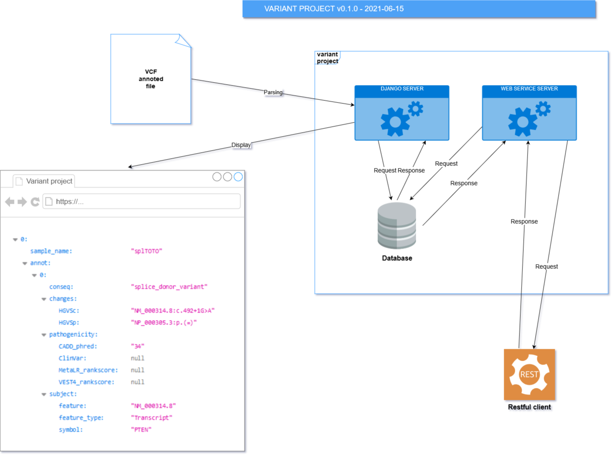

# Release 0.2.0 [2021-06-25]

### Operating diagram for variant_project v0.2.0

### Changes

> The Django server manage both web application and web services :
>
> So, the FastAPI for web services is not used anymore.
> The Pydantic objects in accordance with the FastAPI documentation are not used anymore.

### Improvements

> Only one server for managing two different applications :
> 
>- Web application
>- Web services
> 
> See the **Operating diagram part** above
  
### Bug fixes

> Not applicable

# Release 0.1.0 [2021-06-15]

> First release

### Operating diagram for variant_project v0.1.0

### Changes

> Not applicable

### Improvements

> Not applicable
  
### Bug fixes

> Not applicable

